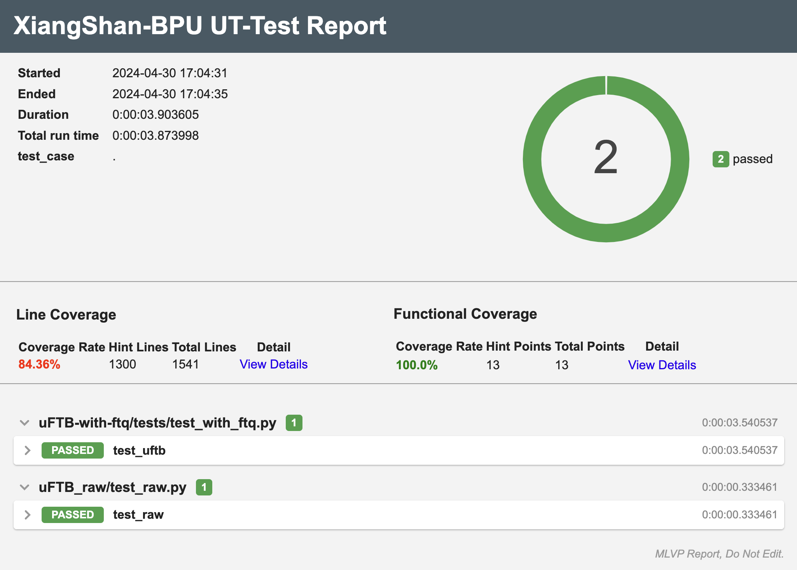

# BPU验证环境

本环境提供BPU验证所需的所有依赖，以及工具包。本验证环境需要在linux系统下运行，包含以下组件

1. 生成待验证的 Python DUT 模块
2. 对DUT进行验证的示例项目
3. 生成验证报告的组件

待验证项目：

- 待验证模块：[XiangShan ea2f767](https://github.com/OpenXiangShan/XiangShan/tree/ea2f767c24941b08d375b2b9529cd11b5850960a)


## 安装依赖

除去基本的gcc/python3开发环境外，本验仓库还依赖如下两个项目，请先行安装，**并安装对应项目的依赖**。

1. [Picker](https://github.com/XS-MLVP/picker)
2. [MLVP](https://github.com/XS-MLVP/mlvp)

再通过以下命令安装其他依赖：
```bash
apt install lcov # genhtml
pip install pytest-sugar pytest-rerunfailures pytest-xdist pytest-assume pytest-html # pytest

```

## 生成待验证模块

下载仓库

```bash
git clone https://github.com/XS-MLVP/env-xs-ov-00-bpu.git
cd env-xs-ov-00-bpu
```

### 生成 uFTB

```bash
make uftb TL=python
```

上述命令会在当前目录中生成out目录，其中 picker_out_uFTB 目录下的 UT_FauFTB 即为待验证的Python Module。可以在python环境中直接导入。因为待验证的python DUT与python版本相关，所以无法提供通用版本的python-dut，需要自行编译。

```bash
out
`-- picker_out_uFTB
    `-- UT_FauFTB
        |-- _UT_FauFTB.so
        |-- __init__.py
        |-- libDPIFauFTB.a
        |-- libUTFauFTB.so
        |-- libUT_FauFTB.py
        |-- uFTB.fst.hier
        `-- xspcomm
            |-- __init__.py
            |-- __pycache__
            |   |-- __init__.cpython-38.pyc
            |   `-- pyxspcomm.cpython-38.pyc
            |-- _pyxspcomm.so -> _pyxspcomm.so.0.0.1
            |-- _pyxspcomm.so.0.0.1
            |-- info.py
            `-- pyxspcomm.py

4 directories, 13 files
```

当导入模块UT_FauFTB后，可以在Python环境中进行简单测试。

```python
from UT_FauFTB import *

if __name__ == "__main__":
    # Create DUT
    uftb = DUTFauFTB()
    # Init DUT with clock pin name
    uftb.init_clock("clock")

    # Your testcases here
    # ...

    # Destroy DUT
    utb.finalize()
```

其他待验证模块，例如 TAGE-SC，FTB也可以通过类似命令生成。

**支持的模块名称有：uftb、tage_sc、ftb、ras、ittage。也可以通过如下命令，一次性生成所有DUT模块。**

```bash
make all TL=python
```

## BPU外围环境

BPU是CPU中的一个模块，单独无法运行，为了对BPU中的子模块进行验证，本环境提供了其所需的外围环境来驱动BPU中的各个模块。

### 分支 Trace 工具：BRTParser

BRTParser 使我们专门为 BPU 验证所设计的能够自动抓取、解析程序指令流中的分支信息的工具，它基于香山前端的开发工具 `OracleBP`。 BRTParser 内部集成了 NEMU 模拟器，可以直接运行程序，并在其中抓取分支信息。BRTParser 会将抓取到的分支信息解析成一种通用的格式，方便后续的验证工作。

具体请参见 `utils` 目录下的 `BRTParser`。

### FTQ 运行环境

由于单独的子预测器模块并无法运行真实的程序，更无法验证其在实际程序中的预测准确率与功能正确性。因此，我们提供了一个简易的 FTQ 环境，该环境使用了 BRTParser 生成的分支信息来生成程序指令执行流。FTQ 将会解析预测器的预测结果，并与实际的分支信息进行比对，从而验证预测器的准确性。另外，FTQ 还会向 BPU 发出重定向信息与更新信息，使得预测器可以在 FTQ 的环境中不间断运行。

为了使一个子预测器能够正常工作，我们还模拟了 BPU 顶层模块，为子预测器提供时序控制等功能。对于非 FTB 类型的子预测器，我们还提供了一个简易的 FTB 实现，用于向子预测器结果中添加 FTB 基础预测结果信息。

目前，我们使用 FTQ 环境驱动了 uFTB 子预测器，并编写了时序精确的 uFTB 参考模型。FTQ 环境的具体实现和使用方法都可以在这个测试用例中获取，详见 `test_src/uFTB-with-ftq`。

## 编写测试用例

参与验证的同学需要编写测试用例，以验证 BPU 子模块的功能正确性，在本仓库中，所有的测试用例都需要被放置在 `tests` 目录下。

我们基于 pytest 提供了一套测试用例的运行框架，可以方便地编写测试用例、定义功能覆盖率、生成测试报告等，因此在编写测试用例时，需要遵循本节中介绍的一些规范。

### 运行测试

我们已经为 uFTB 提供了两个基础的测试用例，每个测试用例被放置在 `tests` 目录下单独的子目录中，子目录名称即为测试用例的名称。在运行测试这两个测试用例之前，请确保 uFTB 模块己经被正确编译，并且测试用例需要的依赖已经被安装。

之后，便可运行相应测试用例。以运行 `uFTB_raw` 测试用例为例，只需在 `tests` 目录下运行如下命令即可：

```bash
make TEST=uFTB_raw run
```

该命令会自动运行 `uFTB_raw` 测试用例，并生成波形、覆盖率和测试报告等信息。测试报告会被保存在 `tests/report` 目录中，可通过浏览器打开 `tests/report/report.html` 查看本次测试报告内容，测试报告样式如下图所示，其余文件也会在 `tests` 目录下生成。

<div style="text-align: center;">
    
</div>

若需要一次性运行所有测试用例，可以运行如下命令：

```bash
make run
```

此时生成的测试报告会包含所有测试用例的测试结果。

### 添加测试用例

在编写自己的测试用例时，只需要在 `tests` 目录下新建一个子目录以作为新测试用例的目录，子目录的名称命名为测试用例的名称。你可以在该目录下添加任意的代码文件，只需要保证测试用例的入口文件为 `test_<测试名称>.py`，在该文件中，测试用例的入口函数也需要被命名为 `test_<测试名称>`。你可以编写一个或多个入口文件和入口函数。

在每个入口函数中，需要遵循如下的格式：

```python

import mlvp.funcov as fc
from mlvp.reporter import set_func_coverage, set_line_coverage

def test_mydut(request):
    # 创建 DUT，并指定本次测试的波形文件和覆盖率文件名称
    # 请注意，每个测试函数所对应的波形文件及覆盖率文件名称应该互不相同，否则会导致文件被覆盖
    my_dut = DUTMydut(waveform_filename="my_test.fst", coverage_filename="my_test_coverage.dat")

    # 指定功能覆盖规则
    g1 = fc.CovGroup("group1")
    # ...
    g2 = fc.CovGroup("group2")
    # ...


    # 测试运行代码
    # ...

    # 结束测试，并录入覆盖率信息，覆盖率文件名称应该与上述指定的覆盖率文件名称相同
    my_dut.finalize()
    set_func_coverage(request, [g1, g2])
    set_line_coverage(request, "my_test_coverage.dat")
```

测试用例编写完成后，可以直接在 `tests` 目录运行：

```python
make TEST=<测试用例名> run
```

即可自动完成测试用例的运行、波形生成、覆盖率统计和测试报告生成等工作。

当本地测试通过后，即可提交测试用例。提交时，测试报告中的测试结果需满足以下要求：

1. 所有测试用例均通过
2. 代码行覆盖率大于 95%
3. 功能覆盖率达到 100%

### 日志输出

在 mlvp 库中，提供了一个专用的日志记录器(logger)，我们推荐使用该 logger 来记录测试过程中的信息。

具体地，你可以使用如下的方式来记录日志：

```python
import mlvp

mlvp.debug("This is a debug message", extra={"log_id": "dut"})
mlvp.info("This is an info message")
mlvp.warning("This is a warning message", extra={"log_id": "bundle"})
mlvp.error("This is an error message")
mlvp.critical("This is a critical message")
```

如果需要改变日志记录格式、日志级别以及写入文件等信息，可通过调用 `mlvp` 库中的 `setup_logging` 函数进行设置：

```python
def setup_logging(
    log_level =logging.INFO,
    format=default_format,
    console_display=True,
    log_file=None)
```
