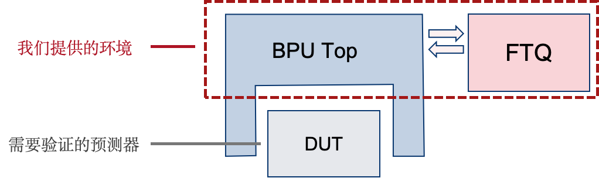

# uFTB-env

## 介绍

本测试用例提供了基于真实指令流的香山处理器 uFTB 分支预测器的仿真验证环境，以及时钟精确的 uFTB 参考模型，最终可给出 uFTB 的分支预测准确率。

为此，我们为 uFTB 提供了简易的 BPU Top Wrapper，以向 uFTB 提供时序控制和输入输出处理。并向 BPU Top 提供了简易的 FTQ 实现，FTQ 中实例化了一个真实的程序仿真器，用于生成真实指令流，FTQ 会处理 BPU 产生的预测结果，并向 BPU 提供更新请求与重定向请求的执行反馈。大致的结构可参考下图：



对于香山 BPU 中其他子预测器的验证，可复用本项目中的真实指令执行环境，但需要对 DUT 的接口、时序以及需要使用的预测结果通道等进行适配。

## 快速使用

### 环境配置

**1. 安装 mlvp**

具体步骤参见 https://github.com/XS-MLVP/mlvp

**2. 生成 BRTParser Trace 工具**

为了生成真实的指令流，BRTParser 作为一个自定义的工具已经被放置在仓库根目录下的 `utils` 文件夹中，但其中缺少了模拟器仿真程序，需要自行编译生成，具体步骤参见 https://github.com/yaozhicheng/NEMU

生成编译结果 `NemuBR` 后，将其放置在 `utils/BRTParser` 目录下，工具即可正常使用。

**3. 编译 DUT**

在本仓库根目录下执行

```shell
make uftb TL=python
```

即可生成 DUT 编译结果，编译结果无需移动，程序会自动检索对应目录。

### 仿真验证

在本测试用例目录下执行

```shell
python uftb-env/tb.py
```

即可开始仿真验证。

程序运行结束后，会打印出分支预测的统计信息。

若要更改需要执行的程序，可在 `config.py` 中更改相应变量的值，仿真所需的真实程序已经放置仓库 `utils/ready-to-run` 目录下。若要更改仿真所持续的周期数，可在 `config.py` 中更改 `MAX_CYCLE` 的值。

## 使用说明

### 目录结构

```
uftb-env/                   # uFTB 环境源码
├── bpu_top.py                  # BPU Top Wrapper
├── bundle.py                   # 定义了 DUT 相关接口
├── config.py                   # 与 uFTB 相关的配置信息
├── executor.py                 # 对 BRTParser 工具的封装
├── ftb.py                      # FTB 项相关结构
├── ftq.py                      # FTQ 实现
├── tb.py                       # 测试用例
├── uftb_model.py               # uFTB 参考模型
└── utils.py                    # 相关工具函数
```

### 指令执行器

`executor.py` 中定义了 `Executor` 类，用于对 BRTParser 工具的封装，提供了生成真实指令流的功能。

实现中，由于 BRTParser 工具只提供了分支指令的跳转 Trace，因此普通指令的长度无法获取，为此普通指令的长度是在 `Executor` 中进行随机生成的。

使用时需要用到两个主要方法：

- `current_inst` 用于获取当前指令。调用时返回当前指令 PC、指令长度及分支指令信息。分支指令如果为空则表示当前指令不是分支指令，否则给出分支指令相关信息。
- `next_inst` 用于执行当前指令。

### FTQ

`ftq.py` 中实现了 FTQ 的相关逻辑，指令执行器也在此被实例化，因此 FTQ 具备了获取真实指令执行情况的能力。


FTQ 的工作流程如下：

1. 在每个周期 `update` 方法被调用，用于更新 FTQ 的状态。此时，如果传入的 BPU 输出信息中，s1 通道有效，则 FTQ 会将 s1 产生的预测结果存入一个 FTQ 项中。
2. 执行一个预测块。FTQ 检测队列中是否还有尚未执行的预测块，如果没有则跳过，如有则执行此预测块，分为两种情况。
    - 如果预测块指示 FTB 项没有 hit，这说明预测结果无效。FTB 会调用执行器，生成一个完整的 FTB 项。
    - 如果预测块指示 FTB 项 hit，并且预测结果中的起始 PC 与执行器当前 PC 相同，则说明本次预测有效。FTQ 会根据预测结果调用执行器，若执行过程中出现与预测结果不符的情况，则 FTQ 生成重定向请求，以供 BPU 恢复到正确状态。
3. 生成更新和重定向请求。FTQ 会使用新生成或者更新后的 FTB 项生成更新请求，如果有预测错误还会生成重定向请求。最终，FTQ 会将更新请求和重定向请求传递给 BPU。

在该 FTQ 实现中，仅仅根据 s1 通道的预测结果来更新 FTQ 队列，对于 s2, s3 通道的预测结果没有进行响应。因此，若需要验证 s2, s3 通道的预测结果，需要对 FTQ 的该部分进行相应的修改。

### BPU Top Wrapper

`bpu_top.py` 中实现了 BPU Top Wrapper，用于向 uFTB 提供时序控制和输入输出处理。由于 uFTB 只在 s1 阶段工作，因此 BPU Top 并没有对 s2, s3 通道的预测结果进行处理，并且在 BPU Top 中将 DUT 中的 `s2_fire` 及 `s3_fire` 端口持续置高，以获取 DUT 在 s3 阶段输出的 `meta` 信息 。如果需要验证 s2, s3 通道的预测结果，需要对 BPU Top 的该部分进行相应的修改。

具体地，`BPU Top` 会维护流水线控制信息，并驱动 DUT。在每个周期，BPU 的工作流程如下：

1. 更新 DUT 的流水线控制信号
2. 获取 DUT 的预测结果并进行加工。BPU Top 会获取 DUT 的预测结果，并且对其中需要 BPU 赋值的部分进行赋值，生成 BPU 的输出信息。
3. 获取 uFTB Model 的预测结果，并进行对比。以此来验证 uFTB 实现的正确性。
4. 将 BPU 输出信息传递给 FTQ，获取 FTQ 的更新请求和重定向请求。
5. 将 FTQ 的更新请求和重定向请求传递给 DUT 和 uFTB Model，并更新流水线控制信号。

在本项目中还实现了一个 `FTBProvider` 用于提供基于 FTB 项的基础预测结果，如果需要验证非 FTB 项的预测结果，需要将 `ftb_provider_stage_enable` 中相应阶段开关打开，便可以在相应阶段添加 FTB 的预测结果。


